# NathanKeen_T2A2

# Blogger Platform API Webserver

## R1 Explain the problem that this app will solve, and explain how this app solves or addresses the problem.
## Problem That This App Will Solve:
This app is a content management system (CMS) for a blogging platform that provides a structured environment for users with different roles to create, interact with, and manage blog content. It addresses the following problems found in modern multi-user blogging platforms:  
1. **User Authentication and Authorisation:**  
    - **Problem:** Modern web applications require secure mechanisms to authenticate users and control access to specific resources based on user roles.  Acoording to a *2020 study by Verizon*, over 80% of breaches are due to weak or stolen credentials, emphasizing the need for secure authentication.
    - **Solution:** This app solves the problem by implementing JWT-based authentication, ensuring that users' identities are securely verified. Role-based access control (RBAC) enforces restrictions based on user roles, allowing only admins and super admins to manage sensitive data like user roles and content.
2. **Role Management:**  
    - **Problem:** Managing permissions for various users can become complicated as the platform scales.
    - **Solution:** The app provides a comprehensive role management system where admins can assign roles (e.g., Admin, Author, Super Admin, Reader) to users. This ensures that each user has the appropriate permissions, which is crucial for minimising the risk of privilege abuse.  
3. **Blog Creation and Interaction:**  
    - **Problem:** Blog platforms need to support the creation, modification, and management of blog content.  As per *HubSpot's blogging statistics*, businesses that blog receive 55% more visitors than those that don't, highlighting the need for smooth blog creation and management.
    - **solution:** The app allows authors to create, edit, and manage blogs while enabling readers to interact through comments and likes. This encourages user engagement and ensures authors have the tools they need to manage content effectively.
4. **Media Management:**
    - **Problem:** Blogs often rely on rich media like images and videos to increase engagement, but managing these files and associating them with the correct content can be difficult.
    - **Solution:** The app includes a media management system that allows users to upload media, ensuring that each file is properly associated with the right blog post. This helps maintain the integrity of multimedia content on the platform, making blogs more engaging.
5. **Category and Organisation:**
    - **Problem:** Readers need a way to easily navigate blog content, and blogs need to be categorised for better organisation and discoverability. According to research, organised content improves user experience and retention rates.
    - **Solution:** The app includes a category system, which helps structure blogs into different sections (e.g., Technology, Lifestyle), enabling users to find relevant content quickly.
6. **Commenting and Liking System:**  
    - **Problem:** User engagement is a key factor for successful blogging platforms. Interaction through comments and likes not only boosts engagement but also provides valuable feedback for content creators.
    - **Solution:** The app provides a commenting system where users can leave feedback on blogs, and a liking system to express approval. Studies show that user engagement features like comments and likes improve user retention.

## How This App Solves or Addresses the Problem:  
1. **Secure Authentication and Role-Based Access Control:**
    - By using JWT for authentication and enforcing RBAC, the app addresses the security challenges mentioned above. This ensures that only authorised users can access specific content and perform certain actions, reducing the risk of unauthorised access and data breaches.
2. **Flexible Role Management:**  
    - The app solves the issue of privilege management by allowing admins to assign roles and control access to sensitive areas of the platform. This aligns with industry best practices for ensuring that users only have the minimum necessary permissions, reducing potential security risks.
3. **Comprehensive Content Creation Tools:**  
    - With tools for creating, editing, and managing blog posts, the app ensures that content creators can focus on writing, while readers have an intuitive and organised way to engage with the content. The platform's built-in interaction features (likes and comments) further enhance user engagement and retention.
4. **Multimedia Content Support:**  
    - The app enables the integration of images, videos, and other media into blogs, making content more engaging and aligning with the modern reader's expectations for rich multimedia experiences. This media management feature solves the problem of associating media files with specific blogs and maintaining their integrity.  
5. **Improved User Experience Through Categorisation:**  
    - By categorising blog posts, the app helps users easily navigate the platform, ensuring a better user experience. This organisational feature improves discoverability and enhances overall satisfaction, encouraging repeat visits and longer user sessions.
## Conclusion
This app addresses the common challenges faced by multi-user blogging platforms by providing robust authentication, flexible role management, efficient content creation tools, and enhanced user engagement features like commenting and liking. By implementing industry best practices in security, user management, and content organisation, the app ensures that it not only meets the needs of content creators and admins but also fosters an engaging experience for readers. The inclusion of references and statistics supports the app's value in solving real-world problems related to blogging and content management.

### Reference
* Verizon. (2020). Data Breach Investigations Report. https://www.verizon.com/business/en-gb/resources/reports/2020-data-breach-investigations-report.pdf
* Bump, P. (2023, December 21). 31 Business Blogging Stats You Need to Know in 2021. Blog.hubspot.com. https://blog.hubspot.com/marketing/business-blogging-in-2015

# R2 Describe the way tasks are allocated and tracked in your project.
## Trello
In my project, tasks are allocated and tracked using a combination of Trello for project management and GitHub for code-related tasks. Trello serves as the main tool for organising and assigning tasks visually through a kanban board. Each task is represented as a card, which can be moved through various stages such as "To Do," "In Progress," and "Done." Cards have descriptions, deadlines, and checklists for tracking progress. Labels and tags help categorise tasks by priority, type, or role, and comments. Trello ensures a high-level view of the project's status.  
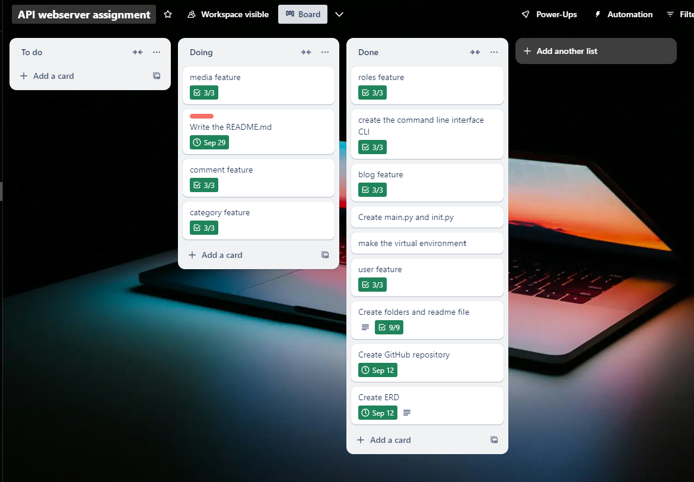  
<br>
On the development side, GitHub is used not only for tracking issues and managing pull requests but also for tracking changes made to the codebase and recovering data when necessary.  Each code contribution is committed to a branch with a detailed history of changes.  This version control system makes it easy to revert to previous versions if needed, ensuring that any errors or unintended changes can be rolled back quickly.

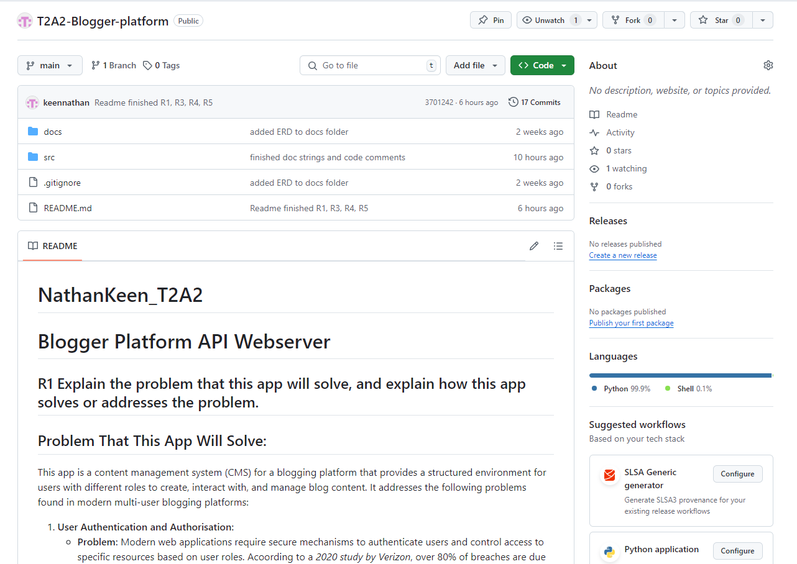

## Links to GitHub and Trello
* https://github.com/keennathan/T2A2-Blogger-platform
* https://trello.com/b/VMMD5LaX/api-webserver-assignment

# R3 List and explain the third-party services, packages and dependencies used in this app.
## Third-Party Services, Packages, and Dependencies Used in This App:
1. **Flask:**  
    - **Purpose:** Flask is a micro web framework for Python that allows developers to build web applications easily with minimal boilerplate code.
    - **How It's Used:** Flask serves as the core framework for routing, handling requests, and providing responses in this application.
    - **Package:** Flask==3.0.3
2. **Flask-SQLAlchemy:**
    - **Purpose:** Provides an Object Relational Mapper (ORM) that integrates SQLAlchemy with Flask, allowing the app to interact with the database using Python objects instead of raw SQL queries.
    - **How It's Used:** Used for defining database models, handling relationships between tables, and performing queries.
    - **Package:** Flask-SQLAlchemy==3.1.1
3. **SQLAlchemy:**  
    - **Purpose:** SQLAlchemy is the ORM used for interacting with the database in a Pythonic way, abstracting raw SQL into high-level operations.
    - **How It's Used:** SQLAlchemy provides the ORM layer that interacts with PostgreSQL through SQL queries and transactions.
    - **Package:** SQLAlchemy==2.0.32
4. **psycopg2-binary:**
    - **Purpose:** psycopg2-binary is a PostgreSQL database adapter for Python. It provides the necessary drivers to connect and interact with PostgreSQL databases.
    - **How It's Used:** This package allows Flask to communicate with a PostgreSQL database by providing a connection to execute SQL queries and manage transactions.
    - **Package:** psycopg2-binary==2.9.9
5. **Flask-JWT-Extended:**  
    - **Purpose:** Adds JWT (JSON Web Token) support to Flask, which is used for token-based authentication and user management.
    - **How It's Used:** The app uses JWTs to authenticate users and ensure secure access to routes that require authorisation.
    - **Package:** Flask-JWT-Extended==4.6.0
6. **Flask-Bcrypt:**  
    - **Purpose:** Provides bcrypt hashing utilities for securely storing user passwords.
    - **How It's Used:** Flask-Bcrypt is used to hash and verify passwords during user registration and login.
    - **Package:** Flask-Bcrypt==1.0.1
7. **Flask-Marshmallow:**
    - **Purpose:** Integrates Marshmallow with Flask to facilitate serialisation, deserialisation, and validation of data.
    - **How It's Used:** Handles converting SQLAlchemy models into JSON and validating incoming data from HTTP requests.
    - **Package:** flask-marshmallow==1.2.1
8. **Marshmallow:**
    - **Purpose:** A library for object serialisation and deserialisation, as well as data validation.
    - **How It's Used:** Used to validate and serialise/deserialise data before sending it in or receiving it from an API.
    - **Package:** marshmallow==3.21.3
9. **marshmallow-sqlalchemy:**
    - **Purpose:** Bridges Marshmallow and SQLAlchemy, automatically generating Marshmallow schemas from SQLAlchemy models.
    - **How It's Used:** Simplifies schema generation by mapping SQLAlchemy models directly to Marshmallow schemas.
    - **Package:** marshmallow-sqlalchemy==1.1.0
10. **python-dotenv:**
    - **Purpose:** Reads key-value pairs from a .env file and sets them as environment variables.
    - **How It's Used:** Loads environment variables such as database URIs and JWT secret keys, making the app configuration more secure and flexible.
    - **Package:** python-dotenv==1.0.1
11. **Jinja2:**
    - **Purpose:** A templating engine used by Flask to render HTML templates dynamically.
    - **How It's Used:** Used by Flask to insert dynamic content into HTML templates (if needed), although this functionality isn't explicitly shown in the code.
    - **Package:** Jinja2==3.1.4
12. **Werkzeug:**
    - **Purpose:** A WSGI utility library used by Flask for routing, request handling, and response generation.
    - **How It's Used:** Handles HTTP requests and responses under the hood for Flask applications.
    - **Package:** Werkzeug==3.0.3
13. **click:**
    - **Purpose:** A package for creating command-line interfaces (CLI). Flask uses Click to manage CLI commands such as running the app, setting up the database, etc.
    - **How It's Used:** Used internally by Flask for handling CLI commands.
    - **Package:** click==8.1.7
14. **PyJWT:**
    - **Purpose:** A Python library to encode and decode JSON Web Tokens (JWT).
    - **How It's Used:** Flask-JWT-Extended uses PyJWT to encode and decode tokens, ensuring secure authentication via tokens.
    - **Package:** PyJWT==2.9.0
15. **blinker:**
    - **Purpose:** A fast event-signal library for Python.
    - **How It's Used:** Used internally by Flask to handle signals for certain events, like before or after request processing.
    - **Package:** blinker==1.8.2  
### Summary
* **Web Framework:** Flask is the primary web framework used to build and serve the application.
* **Database Interaction:** Flask-SQLAlchemy, SQLAlchemy, and psycopg2-binary are used to define models, manage relationships, and connect to a PostgreSQL database.
* **Authentication:** Flask-JWT-Extended and PyJWT handle secure user authentication through JWTs, ensuring that routes are protected.
* **Password Security:** Flask-Bcrypt provides password hashing utilities, protecting user credentials.
* **Serialisation/Validation:** Flask-Marshmallow, Marshmallow, and marshmallow-sqlalchemy handle the serialization of complex objects to JSON and validation of incoming data.
* **Environment Management:** python-dotenv helps securely manage environment variables for configuration settings.
* **Template Rendering and HTTP Handling:** Jinja2 and Werkzeug manage template rendering (if necessary) and HTTP requests, respectively.  
<br>
All these dependencies work together to form a secure, robust, and scalable web application that manages content (blogs, media, comments) while ensuring proper authentication, authorisation, and database interactions.

# R4 Explain the benefits and drawbacks of this app’s underlying database system.
The underlying database system for this app is PostgreSQL, a powerful and feature-rich relational database management system. PostgreSQL is widely known for its robustness, scalability, and support for complex queries and data integrity, making it a strong choice for content management systems like this one, which involves managing users, roles, blogs, comments, and interactions like likes.  

## Pros
One of the biggest advantages of PostgreSQL is its ACID compliance, which ensures that transactions are processed reliably and consistently. This is critical for an application that handles sensitive operations such as user authentication, role management, and content creation. PostgreSQL also excels in maintaining data integrity through constraints like foreign keys and unique indexes, which enforce consistent relationships between entities such as users, blogs, and comments. Additionally, PostgreSQL's ability to efficiently handle complex queries and joins across related tables makes it well-suited for applications that need to query interconnected data, such as retrieving a blog post along with its comments, likes, and author information.  

## Cons
However, PostgreSQL also has some drawbacks, particularly in terms of complexity and resource demands. It can be more difficult to set up and maintain compared to simpler databases like SQLite, as it requires a dedicated server and proper configuration to run efficiently. PostgreSQL can also be resource-intensive, requiring adequate memory, CPU, and storage, which might increase operational costs, especially for smaller teams or projects. In addition, optimising performance under heavy write loads can be challenging, as PostgreSQL requires careful tuning to handle high-frequency updates and inserts efficiently.  

## Conclusion
Overall, PostgreSQL is a solid choice for this app due to its reliability, scalability, and ability to manage complex data relationships. While its complexity and resource demands can be a challenge, these are outweighed by its benefits, particularly for applications like this one that require strong data integrity, transactional consistency, and support for complex queries. As the app grows and handles more user interactions and content, PostgreSQL’s scalability and advanced features will ensure that it continues to perform efficiently.

### References
* Dhruv, S. (2019). Pros and Cons of using PostgreSQL for Application Development. [online] Aalpha. Available at: https://www.aalpha.net/blog/pros-and-cons-of-using-postgresql-for-application-development/.

# R5 Explain the features, purpose and functionalities of the object-relational mapping system (ORM) used in this app.
The object-relational mapping (ORM) system used in this app is SQLAlchemy, integrated with Flask via Flask-SQLAlchemy. SQLAlchemy abstracts the database interactions by mapping database tables to Python objects, enabling developers to manipulate database records using Python code rather than SQL queries. Below are its key features and functionalities:  
1. **Model Definition:** SQLAlchemy allows you to define database tables as Python classes, where each class represents a table and class attributes represent columns.  
    ```
    class Blogs(db.Model):
        __tablename__ = "blogs"
        blog_id = db.Column(db.Integer, primary_key=True)
        title = db.Column(db.String(255), nullable=False)
        content = db.Column(db.Text, nullable=False)
        user_id = db.Column(db.Integer, db.ForeignKey("users.user_id"), nullable=False)
    
        # Relationships
        user = db.relationship("User", back_populates="blogs")
    ```
    - **Explanation:** In this example, the `Blogs` model is mapped to the `blogs` table in the database, with attributes for the blog ID, title, content, and a foreign key `user_id` that links to the users table. SQLAlchemy automatically handles this relationship, allowing developers to access a blog's author via the `user` relationship.  
2. **CRUD Operations:** SQLAlchemy simplifies the process of performing CRUD operations on the database. Here's an example of **creating a new blog post:**
    ```
    @blog_bp.route("/", methods=["POST"])
    @jwt_required()
    def create_blog():
        # Get the current user from JWT
        current_user_id = get_jwt_identity()
        stmt = select(User).where(User.user_id == current_user_id)
        current_user = db.session.execute(stmt).scalar_one_or_none()

        # Creating a new blog post
        new_blog = Blogs(
            title=request.json['title'],
            content=request.json['content'],
            user_id=current_user.user_id
        )
        # Add the new blog to the session
        db.session.add(new_blog)
        # Commit the transaction to save it to the database
        db.session.commit() 

        return jsonify({"message": "Blog created successfully!"}), 201
    ```
    - **Explanation:** Here, SQLAlchemy is used to create a new `Blogs` object and add it to the session. The `db.session.add(new_blog)` method stages the new blog to be added to the database, and `db.session.commit()` commits the transaction, persisting the blog post in the database. This showcases the ease of performing Create operations with SQLAlchemy.  
3. **Relationship Management:** SQLAlchemy supports managing relationships between models, such as **one-to-many** relationships between `User` and `Blogs`. This allows developers to easily navigate between related records.  
    ```
    class User(db.Model):
        __tablename__ = "users"
        user_id = db.Column(db.Integer, primary_key=True)
        username = db.Column(db.String(255), unique=True, nullable=False)

        # Relationships
        blogs = db.relationship("Blogs", back_populates="user", lazy="dynamic")
    ```
    - **Explanation:** In this example, a `User` can have multiple blogs. The `blogs` relationship allows you to access all blog posts authored by a particular user. For instance, `user.blogs` would give you a list of all blogs linked to that user, leveraging SQLAlchemy's relationship management.  
## Conclusion
SQLAlchemy's ORM system in this app simplifies database interactions by mapping Python objects to relational tables, handling CRUD operations with ease, and managing complex relationships between entities like `User` and `Blogs`. By allowing developers to work at a higher abstraction level with Python code, SQLAlchemy reduces the need for writing raw SQL queries and provides a more intuitive way to work with the database, ensuring consistency and scalability in the application.


# R6 Design an entity relationship diagram (ERD) for this app’s database, and explain how the relations between the diagrammed models will aid the database design. This should focus on the database design BEFORE coding has begun, eg. during the project planning or design phase.
 
## Entity Relationship Diagram (ERD) Explanation: 
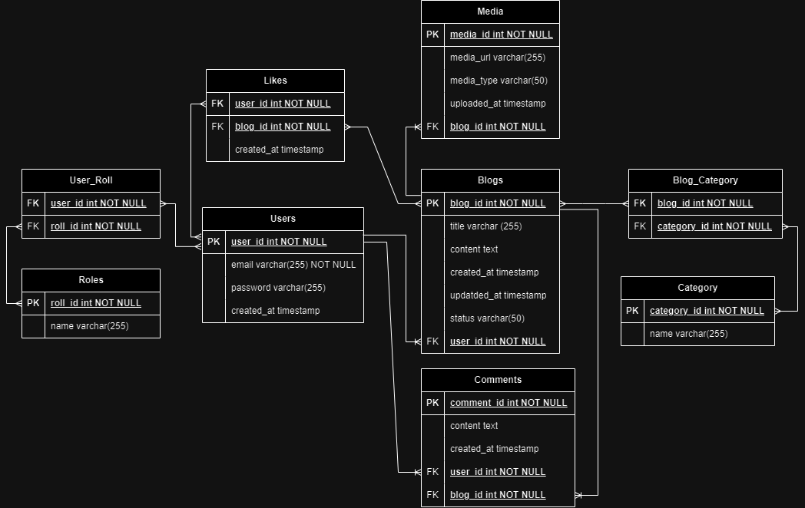  
The Entity Relationship Diagram (ERD) illustrates the relationships between the various models in the app's database:
* **User:**
    - Has relationships with *Blogs*, *Comments*, *Likes*, and *Roles*.
    - Users can create *Blogs*, post *Comments*, like *Blogs*, and be assigned different *Roles* (e.g., Admin, Author).  
* **Blogs:**
    - Related to *Users* (authors), *Comments*, *Likes*, *Categories*, and *Media*.
    - Each Blog is authored by a User and can have multiple Comments, Likes, be categorised into Categories, and contain Media (e.g., images, videos).
* **Comments:**  
    - Related to both *Users* (who post them) and *Blogs* (the blog being commented on).
* **Likes:**  
    - Related to both *Users* (who like the blog) and *Blogs* (the blog being liked).
* **Roles:**  
    - Related to *Users*.
    - *Roles* determine user privileges (e.g., Admin, Author) and are linked via a many-to-many relationship with *Users*.
* **Categories:**  
    - Related to *Blogs*.
    - Each *Blog* can belong to one or more *Categories*.
* **Media:**  
    - Related to *Blogs*.
    - Each *Blog* can have associated *Media*, such as images or videos. 
## How These Relations Aid Database Design:
1. **Data Integrity and Consistency:**  
    - The relationships help enforce data integrity through foreign key constraints. For example, *Blogs* are linked to *Users* through the `user_id` foreign key, ensuring that only valid users can author blogs.
2. **Efficient Data Retrieval:**  
    - The relationships make it easy to retrieve related data. For instance, you can easily query a *User* and get all their *Blogs*, *Comments*, and *Likes*. Similarly, you can fetch a *Blog* and retrieve all associated *Comments*, *Likes*, and *Media*.
3. **Access Control and Role Management:**  
    - The relationship between *Users* and *Roles* aids in access control, ensuring that users have the appropriate permissions to perform actions (e.g., only *Admins* can delete blogs).
4. **Categorisation and Organisation:**  
    - The relationship between *Blogs* and *Categories* allows for easy content categorisation and filtering, improving user experience by enabling readers to find blogs based on categories.
5. **Media Management:**  
    - Linking *Media* to *Blogs* ensures that multimedia content is properly associated with blog posts, enhancing the richness of the content while maintaining relational consistency between the tables.  
<br>
Overall, the relationships represented in the ERD form the backbone of a well-structured and normalised database, enabling scalable, consistent, and efficient data management within the app. ​

## Comparison of Normalisation Levels
In the ERD, the app's database follows a normalised structure that prevents data redundancy and ensures data integrity, typically reflecting **third normal form** (3NF), where:
* No repeating groups are present in any tables.
* Each non-key attribute depends only on the primary key, ensuring no partial dependencies.
* No transitive dependencies exist (i.e., non-key attributes are independent of each other).
### Example of Normalisation: User and Roles Relationship
In the ERD, *Users* and *Roles* have a *many-to-many* relationship facilitated by the *UserRole* join table (as is typical in 3NF). Each user can have multiple roles, and each role can be assigned to multiple users. This join table ensures that role assignments are normalized and avoids duplicating user or role data across multiple entries.

### Comparison with Second Normal Form (2NF):
In 2NF, you might still have a join table, but there could be partial dependencies. For instance, if the user’s details (e.g., username or email) were stored in the same table as their role assignments, you would have redundant data. This would violate the principles of normalisation because if a user's details change, you would have to update multiple records for each role assignment.


# R7 Explain the implemented models and their relationships, including how the relationships aid the database implementation. This should focus on the database implementation AFTER coding has begun, eg. during the project development phase.
## Implemented Models and Their Relationships  
In this app, various models and relationships are implemented using SQLAlchemy and Flask-SQLAlchemy. Below, I'll describe these models and their relationships, explaining how they aid the database implementation.  
## User Model
* The `User` model represents users in the application. Each user can have multiple blogs, comments, likes, and roles.  

    ```
    class User(db.Model):
        __tablename__ = "users"
        user_id = db.Column(db.Integer, primary_key=True)
        username = db.Column(db.String(255), unique=True, nullable=False)
        email = db.Column(db.String(255), unique=True, nullable=False)
        password_hash = db.Column(db.String(255), nullable=False)
        created_at = db.Column(db.DateTime, default=lambda: datetime.now(timezone.utc))

        # Relationships
        blogs = db.relationship('Blogs', back_populates='user', lazy='dynamic')
        comments = db.relationship('Comments', back_populates='user', lazy='dynamic')
        likes = db.relationship('Likes', back_populates='user', lazy='dynamic')
        roles = db.relationship('Role', secondary='user_role', back_populates='user')
    ```
* **Explanation:** This model defines the `User` entity. It has a *one-to-many* relationship with `Blogs`, `Comments`, and `Likes`, and a *many-to-many* relationship with `Roles` through the `UserRole` join table. These relationships allow users to create multiple blogs, comments, and likes, while also allowing them to hold multiple roles. 

## Blogs Model
* The `Blogs` model represents blog posts. Each blog post is associated with a user (author) and can have multiple comments, likes, categories, and media files.  
    ```
    class Blogs(db.Model):
        __tablename__ = "blogs"
        blog_id = db.Column(db.Integer, primary_key=True)
        title = db.Column(db.String(255), nullable=False)
        content = db.Column(db.Text, nullable=False)
        status = db.Column(db.String(50), nullable=False, default="draft")
        created_at = db.Column(db.DateTime, default=lambda: datetime.now(timezone.utc))
        updated_at = db.Column(db.DateTime, onupdate=lambda: datetime.now(timezone.utc))
        user_id = db.Column(db.Integer, db.ForeignKey('users.user_id'), nullable=False)

        # Relationships
        user = db.relationship('User', back_populates='blogs')
        comments = db.relationship('Comments', back_populates='blogs', lazy='dynamic')
        likes = db.relationship('Likes', back_populates='blogs', lazy='dynamic')
        categories = db.relationship('Category', secondary='blog_category', back_populates='blogs')
        media = db.relationship('Media', back_populates='blogs', cascade='all, delete-orphan')
    ```
* **Explanation:** The `Blogs` model has a *many-to-one* relationship with `User`, meaning each blog is authored by one user. It also has *one-to-many* relationships with `Comments`, `Likes`, and `Media`, allowing a blog to have multiple comments, likes, and media files. Additionally, it has a *many-to-many* relationship with `Categories` through the `BlogCategory` join table, allowing blogs to be categorised.  
## Comments Model
* The `Comments` model represents user comments on blog posts.  
    ```
    class Comments(db.Model):
        __tablename__ = "comments"
        comment_id = db.Column(db.Integer, primary_key=True)
        content = db.Column(db.Text, nullable=False)
        created_at = db.Column(db.DateTime, default=lambda: datetime.now(timezone.utc))
        updated_at = db.Column(db.DateTime, onupdate=lambda: datetime.now(timezone.utc))
        user_id = db.Column(db.Integer, db.ForeignKey("users.user_id"), nullable=False)
        blog_id = db.Column(db.Integer, db.ForeignKey('blogs.blog_id'), nullable=False)

        # Relationships
        user = db.relationship('User', back_populates='comments')
        blogs = db.relationship('Blogs', back_populates='comments')
    ```  
* **Explanation:** The `Comments` model has *many-to-one* relationships with both `User` and `Blogs`, meaning each comment belongs to one user and one blog. This ensures that comments are associated with both the blog they are posted on and the user who posted them.  

## Likes Model  
* The `Likes` model tracks which users have liked which blogs. It uses a composite primary key to ensure that a user can only like a blog once.  
    ```
    class Likes(db.Model):
        __tablename__ = "likes"
        created_at = db.Column(db.DateTime, default=lambda: datetime.now(timezone.utc))
        user_id = db.Column(db.Integer, db.ForeignKey('users.user_id'), primary_key=True)
        blog_id = db.Column(db.Integer, db.ForeignKey('blogs.blog_id'), primary_key=True)

        # Relationships
        user = db.relationship('User', back_populates='likes')
        blogs = db.relationship('Blogs', back_populates='likes')
    ```  
* **Explanation:** The `Likes` model establishes a *many-to-one* relationship with both `User` and `Blogs`, allowing a blog to be liked by multiple users. The composite primary key (using both `user_id` and `blog_id`) ensures that each user can only like a particular blog once.  

## Role Model  
* The `Role` model represents user roles, such as "Admin" or "Author". It is related to the `User` model through the `UserRole` join table.  
    ```
    class Role(db.Model):
        __tablename__ = "roles"
        role_id = db.Column(db.Integer, primary_key=True)
        role_name = db.Column(db.String(255), unique=True, nullable=False)

        # Relationship with users
        user = db.relationship('User', secondary='user_role', back_populates='roles')
    ```
* **Explanation:** The `Role` model uses a *many-to-many* relationship with `User` through the `UserRole` join table, allowing users to have multiple roles and roles to be assigned to multiple users.  

## Category Model
* The `Category` model allows blogs to be categorised. It is related to `Blogs` through the `BlogCategory` join table.  
    ```
    class Category(db.Model):
        __tablename__ = "categories"
        category_id = db.Column(db.Integer, primary_key=True)
        category_name = db.Column(db.String(255), unique=True, nullable=False)

        # Relationship with blogs
        blogs = db.relationship('Blogs', secondary='blog_category', back_populates="categories")
    ```  
* **Explanation:** The `Category` model has a *many-to-many* relationship with `Blogs` through the `BlogCategory` join table, allowing each blog to belong to multiple categories and each category to contain multiple blogs.  

## Media Model 
* The `Media` model stores media files (e.g., images, videos) associated with blogs.  
    ```
    class Media(db.Model):
        __tablename__ = "media"
        media_id = db.Column(db.Integer, primary_key=True)
        media_url = db.Column(db.String(255), nullable=False)
        media_type = db.Column(db.String(50), nullable=False)
        created_at = db.Column(db.DateTime, default=lambda: datetime.now(timezone.utc))
        blog_id = db.Column(db.Integer, db.ForeignKey('blogs.blog_id'), nullable=False)

        # Relationships
        blogs = db.relationship('Blogs', back_populates='media')
    ```   
* **Explanation:** The `Media` model has a *many-to-one* relationship with `Blogs`, allowing a blog to have multiple media files associated with it. This relationship helps maintain media content linked to specific blogs.  

### Conclusion
The relationships between the models (one-to-many, many-to-one, and many-to-many) aid the database design by ensuring data integrity and supporting efficient querying. These relationships allow the app to scale by handling complex queries such as retrieving all comments for a blog, all blogs written by a user, or all users with a particular role, while ensuring that data is not duplicated unnecessarily across tables.

# R8 Explain how to use this application’s API endpoints. Each endpoint should be explained, including the following data for each endpoint:

* HTTP verb
* Path or route
* Any required body or header data
* Response

## How to Use the Application’s API Endpoints
Here is a step-by-step guide on how to use the API endpoints for the application. Each endpoint's HTTP verb, path/route, required body or header data, and response are detailed below.  

## Authenticaion Endpoints 
1. **Register User**  
    - **HTTP Verb:** 
    - **Path:** `http://localhost:8080/auth/register`
    - **Required Data:**  
        - **Body(JSON):** "username", "email", "password"
    - **Response:**
        - **Success:** 
            - `201` 201: Successful registration, returns the user's data and a JWT token. 
        - **Failure:**
            - `409`: Email is already registered.
            - `400`: Database constraint violation (e.g., missing required fields or unique email violation).
            - `500`: Server errors.
    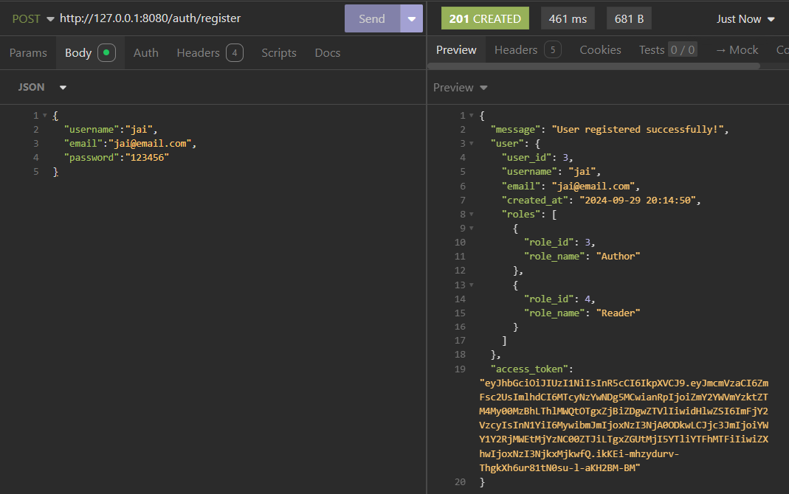    


2. **Login User**  
    - **HTTP Verb:** `POST`
    - **Path:** `http://localhost:8080/auth/login`
    - **Required Data:**  
        - **Body(JSON):** "email", "password"
    - **Response:**
        - **Success:**
            - `200`: Successful login, returns the JWT token.
        - **Failure:**
            - `400`: Email or password missing in the request.
            - `401`: Invalid email or password.
            - `500`: Server errors.
    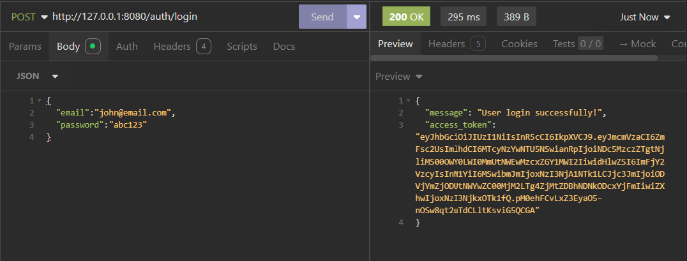


3. **Get Users**  
    - **HTTP Verb:** `GET` 
    - **Path:** `http://localhost:8080/auth/users
    - **Required Data:**  
        - **Body(JSON):** None
        - **Headers:** `Authorisation:` Bearer `<JWT token>`
    - **Response:**
        - **Success:** 
            - `200`: Successful retrieval of all users. 
        - **Failure:** 
            - `400`: Validation errors.
            - `500`: Server errors.
    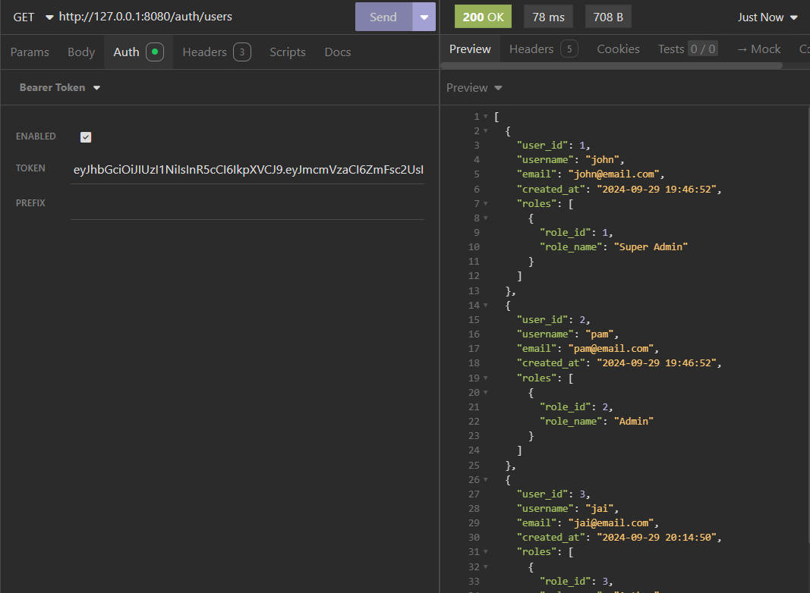


4. **Update User Profile**  
    - **HTTP Verb:** `PUT`, `PATCH`
    - **Path:** `http://localhost:8080/auth/users`
    - **Required Data:**  
        - **Body(JSON):** "username", "email", "old_password", and "new_password"
        - **Headers:** `Authorisation:` Bearer `<JWT token>`
    - **Response:**
        - **Success:**
            - `200`: Successfully updated user information.
        - **Failure:**
            - `400`: Validation errors, e.g., missing old password when updating the password.
            - `403`: Incorrect current password when trying to change the password.
            - `404`: User not found.
            - `409`: New email is already in use.
            - `500`: Server errors.
    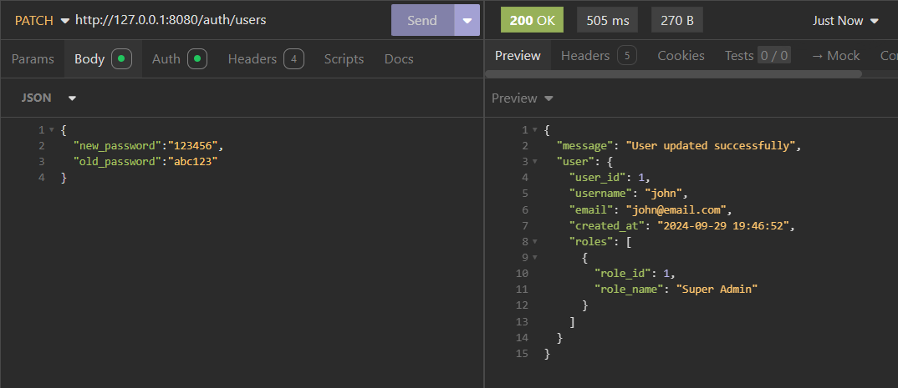


5. **Delete User Account**  
    - **HTTP Verb:** `DELETE`
    - **Path:** `http://localhost:8080//auth/users/<int:user_id>`
    - **Permissions:** 
        - A user can delete their own account.
        - Admins can delete regular users.
        - Super Admins can delete Admins and other Super Admins.
    - **Required Data:**  
        - **Body(JSON):** None
        - **Headers:** `Authorisation:` Bearer `<JWT token>`
    - **Response:**
        - **Success:**  
            - `200`: Successfully deleted the user.
        - **Failure:**
            - `403`: Permission denied (e.g., trying to delete a user with higher privileges).
            - `404`: User to be deleted not found.
            - `500`: Server errors.
    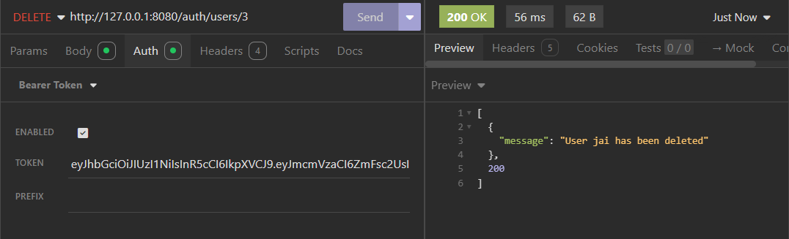

## Blog post Endpoints

1. **Create a Blog Post**  
    - **HTTP Verb:** `POST`
    - **Path:** `http://localhost:8080/blogs
    - **Required Data:**  
        - **Body(JSON):** "title", "content", "status"
        - **Headers:** `Authorisation:` Bearer `<JWT token>`
    - **Response:**
        - **Success:**
            -201: Blog created successfully.
        
        - **Failure:**
            - 403: If the user does not have permission to create a blog.
            - 404: If the current user is not found.
            - 400: If validation errors occur with the request data.
            - 500: If an integrity error or other server error occurs.
    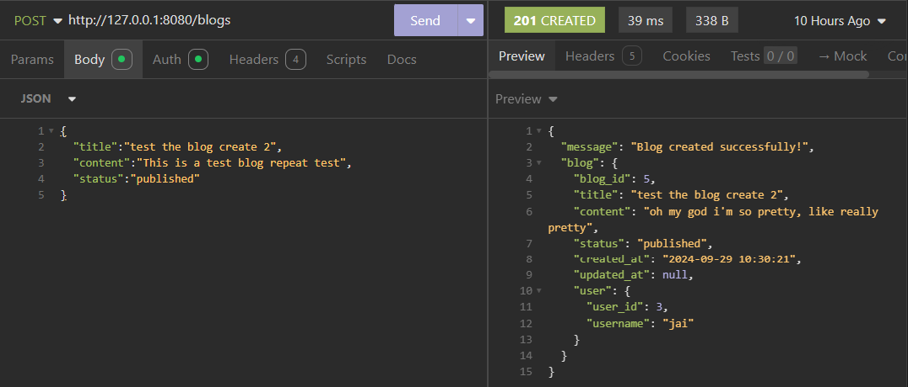

2. **Get Blogs by Status**  
    - **HTTP Verb:** `GET`
    - **Path:** `http://localhost:8080//blogs/status/<string:status>` 
        **Required Path Parameter:** "published", "draft"
    - **Required Data:**  
        - **Body(JSON):** None
        - **Headers:** `Authorisation:` Bearer `<JWT token>`
    - **Response:**
        - **Success:**
            - 200: Blogs retrieved successfully.
        
        - **Failure:**
            - 404: If no blogs with the given status are found.
            - 500: For any other server errors.
    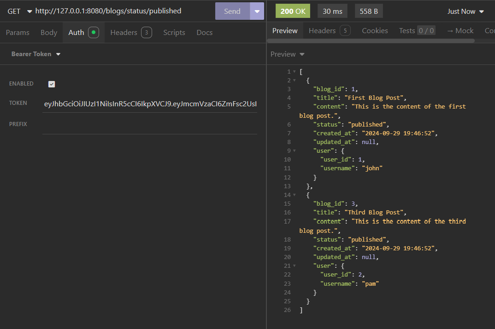

3. **Get Blogs by a Specific User**  
    - **HTTP Verb:** `GET`
    - **Path:** `http://localhost:8080//blogs/user/<int:user_id>`
    - **Required Data:**  
        - **Body(JSON):** None
        - **Headers:** `Authorisation:` Bearer `<JWT token>`
    - **Response:**
        - **Success:**
            - 200: Blogs retrieved successfully.
        
        - **Failure:**
            - 404: If the user or their blogs are not found.
            - 500: For any other server errors.
    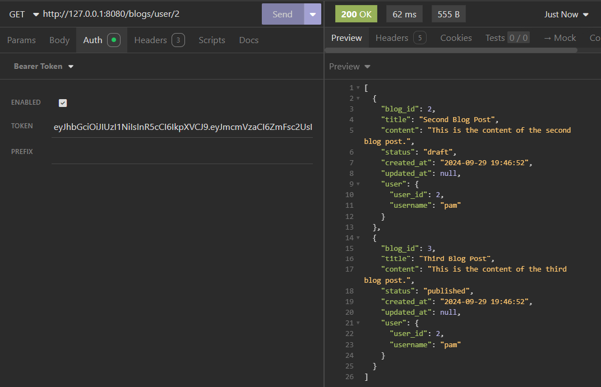
    

4. **Get a Single Blog Post**  
    - **HTTP Verb:** `GET`
    - **Path:** `http://localhost:8080//blogs/<int:blog_id>`
    - **Required Data:**  
        - **Body(JSON):** None
        - **Headers:** `Authorisation:` Bearer `<JWT token>`
    - **Response:**
        - **Success:**
            - 200: Blog retrieved successfully.
        
        - **Failure:**
            - 404: If the blog is not found.
            - 500: For any other server errors.
    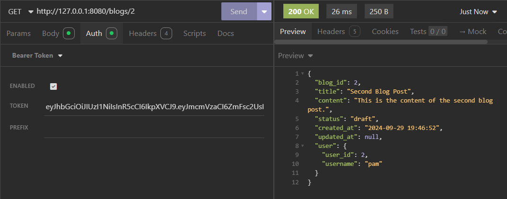


1. **Update a Blog Post**  
    - **HTTP Verb:** `PUT`, `PATCH`
    - **Path:** `http://localhost:8080//blogs/<int:blog_id>`
    - **Required Data:**  
        - **Body(JSON):** "title", "content", "status"
        - **Headers:** `Authorisation:` Bearer `<JWT token>`
    - **Response:**
        - **Success:**
             - 200: Blog updated successfully.
        
        - **Failure:**
            - 403: If the user does not have permission to update the blog.
            - 404: If the blog or current user is not found.
            - 400: If validation errors occur with the request data.
            - 500: For any other server errors.
    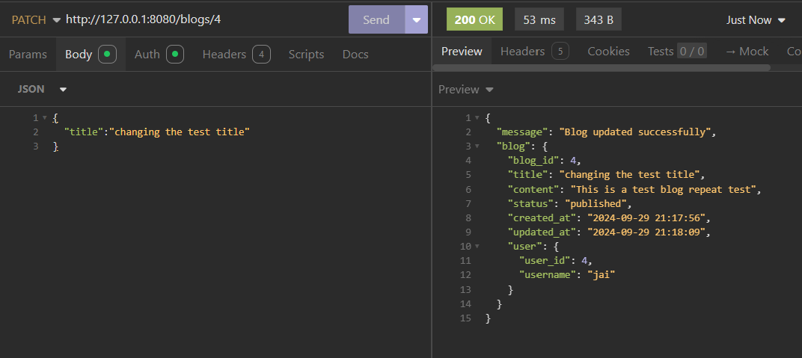

1. **Delete a Blog Post**  
    - **HTTP Verb:** `DELETE`
    - **Path:** `http://localhost:8080//blogs/<int:blog_id>`
    - **Required Data:**  
        - **Body(JSON):** None
        - **Headers:** `Authorisation:` Bearer `<JWT token>`
    - **Response:**
        - **Success:**
            - 200: Blog deleted successfully.
        
        - **Failure:**
            - 403: If the user does not have permission to delete the blog.
            - 404: If the blog or current user is not found.
            - 500: For any other server errors.
    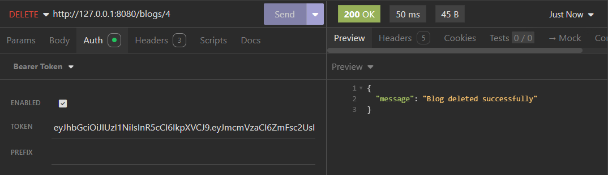

## Like Endpoints

1. **Add a Like to a Blog**  
    - **HTTP Verb:** `POST`
    - **Path:** `http://localhost:8080/likes
    - **Required Data:**  
        - **Body(JSON):** "blog_id"
        - **Headers:** `Authorisation:` Bearer `<JWT token>`
    - **Response:**
        - **Success:**
            - 201: If the like is successfully added.
        
        - **Failure:**
            - 400: If the blog_id is missing or the blog is already liked by the user.
            - 500: If there is a database or unexpected error.
    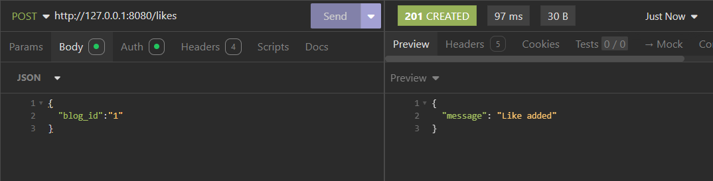

2. **Remove a Like from a Blog**  
    - **HTTP Verb:** `DELETE`
    - **Path:** `http://localhost:8080/likes`
    - **Required Data:**  
        - **Body(JSON):** "blog_id"
        - **Headers:** `Authorisation:` Bearer `<JWT token>`
    - **Response:**
        - **Success:**
            - 200: If the like is successfully removed.
        
        - **Failure:**
            - 404: If the like is not found.
            - 500: If there is a database or unexpected error.
    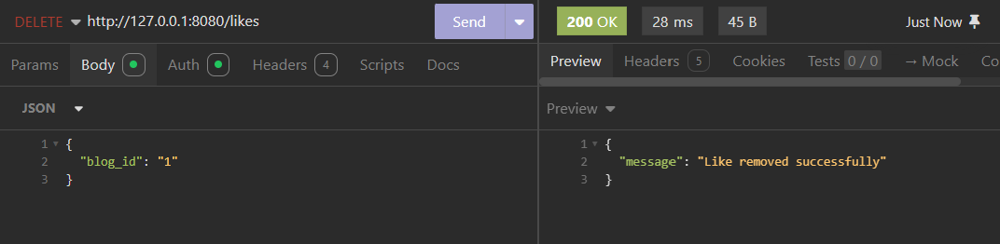

3. **Get All Users Who Liked a Blog**  
    - **HTTP Verb:** `GET`
    - **Path:** `http://localhost:8080/likes/users/blog/<int:blog_id>`
    - **Required Data:**  
        - **Body(JSON):** None
        - **Headers:** `Authorisation:` Bearer `<JWT token>`
    - **Response:**
        - **Success:**
            - 200: List of users who liked the blog.
        
        - **Failure:**
            - 404: If no users are found who liked the blog.
            - 500: If there is a database or unexpected error.
    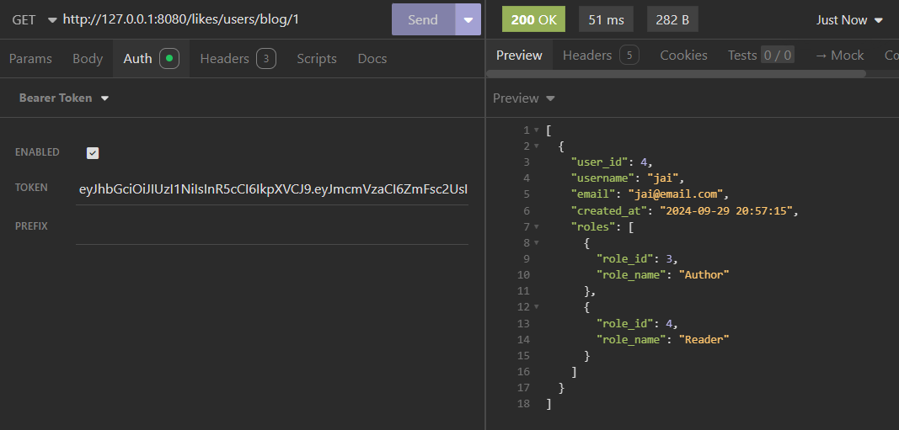

4. **Get Total Likes for a Blog**  
    - **HTTP Verb:** `GET`
    - **Path:** `http://localhost:8080/likes/count/blog/<int:blog_id>`
    - **Required Data:**  
        - **Body(JSON):** None
        - **Headers:** `Authorisation:` Bearer `<JWT token>`
    - **Response:**
        - **Success:**
            - 200: The total number of likes for the blog.
        
        - **Failure:**
            - 404: If no likes are found for the blog.
            - 500: If there is a database or unexpected error.
    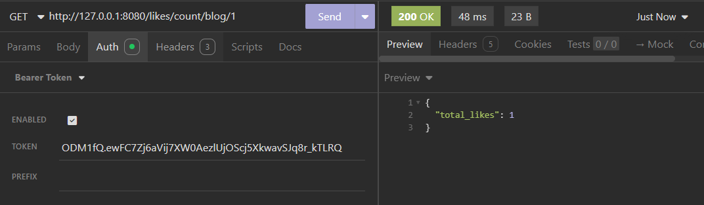

5. **Get All Liked Blogs for the Current User**  
    - **HTTP Verb:** `GET`
    - **Path:** `http://localhost:8080/likes/blogs/user`
    - **Required Data:**  
        - **Body(JSON):** None
        - **Headers:** `Authorisation:` Bearer `<JWT token>`
    - **Response:**
        - **Success:**
            - 200: List of liked blogs.
        
        - **Failure:**
            - 404: If no blogs have been liked by the current user.
            - 500: If there is a database or unexpected error.
    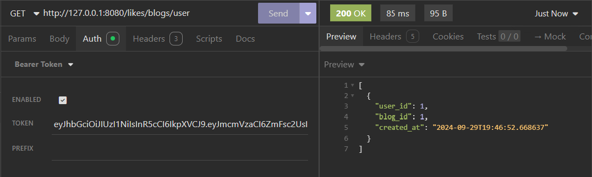


## Role Endpoints

1. **Get All Roles**  
    - **HTTP Verb:** `GET`
    - **Path:** `http://localhost:8080/roles
    - **Required Data:**  
        - **Body(JSON):** None
        - **Headers:** None
    - **Response:**
        - **Success:**
            - 200: List of roles.
        
        - **Failure:**
            - 500: If an error occurs while retrieving roles.
    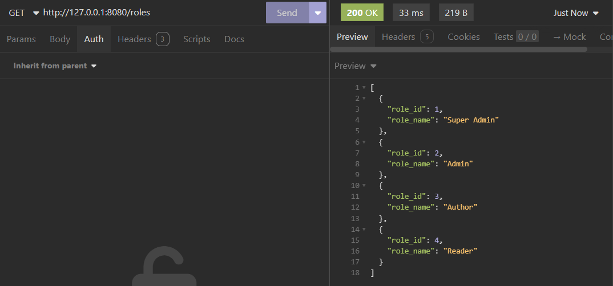

2. **Assign a Role to a User (Admin/Super Admin Only)**  
    - **HTTP Verb:** `POST`
    - **Path:** `http://localhost:8080/roles/assign`
    - **Required Data:**  
        - **Body(JSON):** "user_id", "role_id"
        - **Headers:** `Authorisation:` Bearer `<JWT token>` 
    - **Response:**
        - **Success:**
             - 200: If the role is successfully assigned.
        
        - **Failure:**
            - 400: If user_id or role_id is missing, or if the user already has the role.
            - 404: If the user or role is not found.
            - 500: If an error occurs while assigning the role.
    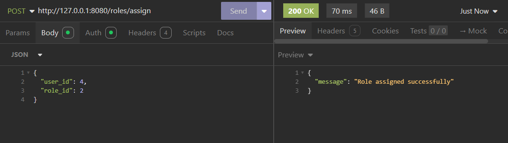

3. **Create a New Role (Admin/Super Admin Only)**  
    - **HTTP Verb:** `POST
    - **Path:** `http://localhost:8080/roles`
    - **Required Data:**  
        - **Body(JSON):** "role_name"
        - **Headers:** `Authorisation:` Bearer `<JWT token>` 
    - **Response:**
        - **Success:**
            - 201: If the role is successfully created.
        
        - **Failure:**
            - 400: If role_name is missing or the role already exists.
            - 500: If an error occurs while creating the role.
    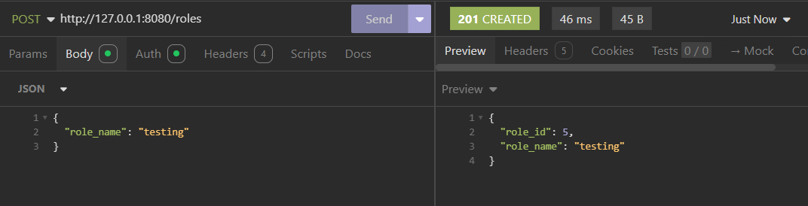

4. **Update an Existing Role (Admin/Super Admin Only)**  
    - **HTTP Verb:** `PUT`, `PATCH`
    - **Path:** `http://localhost:8080/roles/<int:role_id>`
    - **Required Data:**  
        - **Body(JSON):** "role_name"
        - **Headers:** `Authorisation:` Bearer `<JWT token>` 
    - **Response:**
        - **Success:**
            - 200: If the role is successfully updated.
        
        - **Failure:**
            - 400: If role_name is missing or the new role name already exists.
            - 404: If the role is not found.
            - 500: If an error occurs while updating the role.
    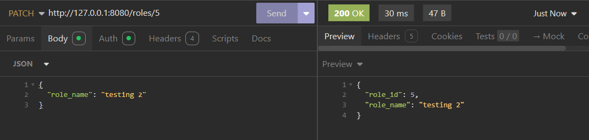

5. **Delete an Existing Role (Admin/Super Admin Only)**  
    - **HTTP Verb:** `DELETE`
    - **Path:** `http://localhost:8080/roles/<int:role_id>`
    - **Required Data:**  
        - **Body(JSON):** None
        - **Headers:** `Authorisation:` Bearer `<JWT token>`
    - **Response:**
        - **Success:**
            - 200: If the role is successfully deleted.
        
        - **Failure:**
            - 404: If the role is not found.
            - 500: If an error occurs while deleting the role.
    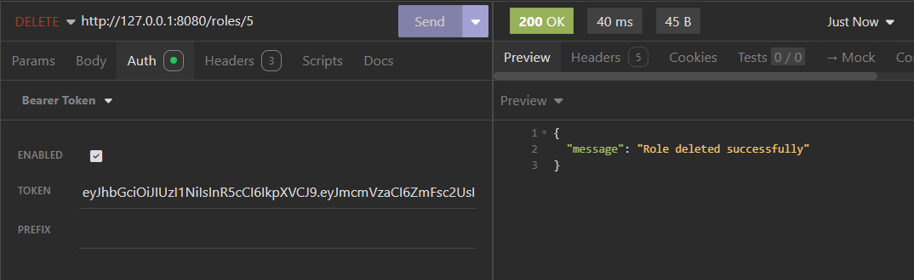

## Comment Endpoints

1. **Create a Comment on a Blog**  
    - **HTTP Verb:** `POST`
    - **Path:** `http://localhost:8080/comments/blogs/<int:blog_id>`
    - **Required Data:**  
        - **Body(JSON):** "content"
        - **Headers:** `Authorisation:` Bearer `<JWT token>`
    - **Response:**
        - **Success:**
            - 201: Comment created successfully.
        
        - **Failure:**
            - 400: If validation fails or input data is missing.
            - 500: If a database or unexpected error occurs.
    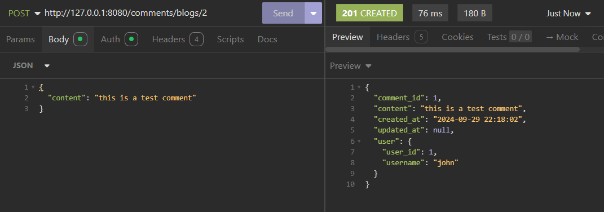

2. **Get All Comments for a Blog**  
    - **HTTP Verb:** `GET`
    - **Path:** `http://localhost:8080/comments/blogs/<int:blog_id>`
    - **Required Data:**  
        - **Body(JSON):** None
        - **Headers:** `Authorisation:` Bearer `<JWT token>`
    - **Response:**
        - **Success:**
            - 200: List of comments.
        
        - **Failure:**
            - 500: If a database or unexpected error occurs.
    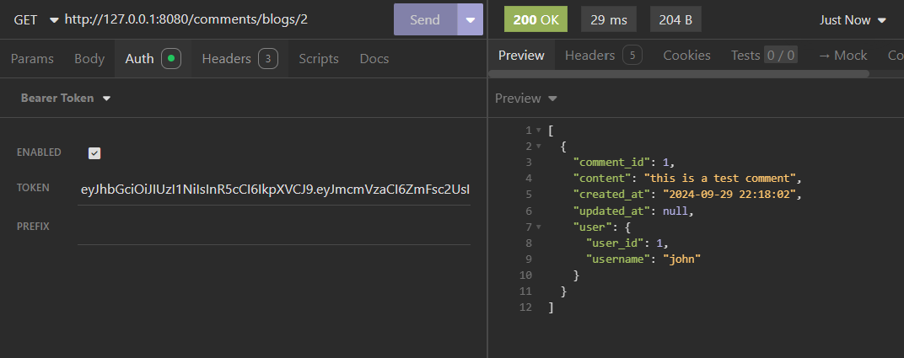

3. **Delete a Comment**  
    - **HTTP Verb:** `DELETE`
    - **Path:** `http://localhost:8080/comments/<int:comment_id>`
    - **Required Data:**  
        - **Body(JSON):** None
        - **Headers:** `Authorisation:` Bearer `<JWT token>`
    - **Response:**
        - **Success:**
            - 200: Comment deleted successfully.
        
        - **Failure:**
            - 403: Unauthorised if the user does not own the comment.
            - 404: If the comment is not found.
            - 500: If a database or unexpected error occurs.
    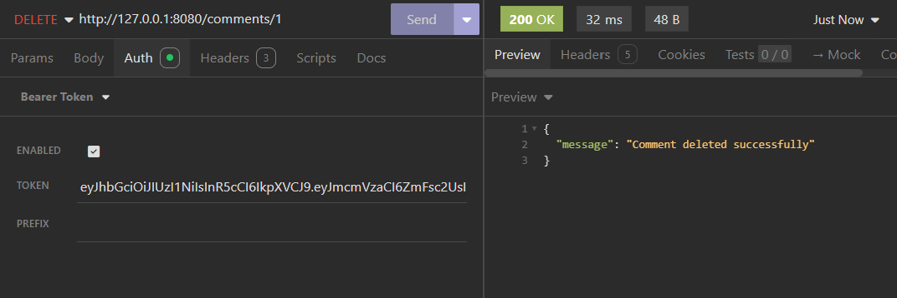

## Category Endpoints

1. **Get All Categories**  
    - **HTTP Verb:** `GET`
    - **Path:** `http://localhost:8080/categories`
    - **Required Data:**  
        - **Body(JSON):** None
        - **Headers:** `Authorisation:` Bearer `<JWT token>`
    - **Response:**
        - **Success:**
            - 200: List of categories in JSON format.
        
        - **Failure:**
            - 500: If an error occurs while fetching categories.


2. **Create a New Category (Admin/Super Admin Only)**  
    - **HTTP Verb:** `POST`
    - **Path:** `http://localhost:8080/categories`
    - **Required Data:**  
        - **Body(JSON):** "category_name"
        - **Headers:** `Authorisation:` Bearer `<JWT token>`
    - **Response:**
        - **Success:**
            - 201: The newly created category.
        
        - **Failure:**
            - 400: Validation errors for the input data.
            - 409: If the category already exists.
            - 500: If an error occurs while creating the category.
    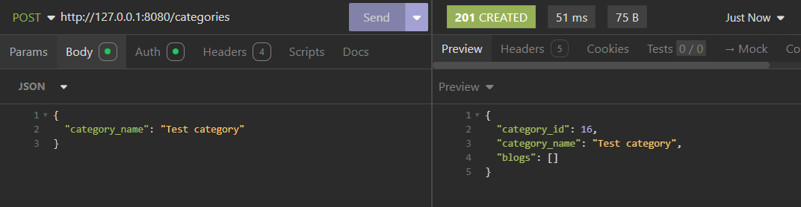

3. **Update a Category (Admin/Super Admin Only)**  
    - **HTTP Verb:** `PUT`, `PATCH`
    - **Path:** `http://localhost:8080/categories/<int:category_id>`
    - **Required Data:**  
        - **Body(JSON):** "category_name"
        - **Headers:** `Authorisation:` Bearer `<JWT token>`
    - **Response:**
        - **Success:**
            - 200: The updated category.
        
        - **Failure:**
            - 409: If a category with the same name already exists.
            - 404: If the category is not found.
            - 500: If an error occurs while updating the category.
    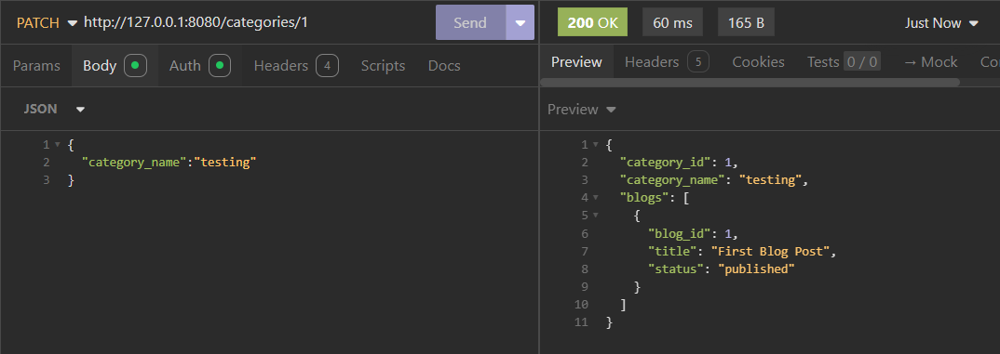

4. **Delete a Category (Admin/Super Admin Only)**  
    - **HTTP Verb:** `DELETE`
    - **Path:** `http://localhost:8080/categories/<int:id>`
    - **Required Data:**  
        - **Body(JSON):** None
        - **Headers:** `Authorisation:` Bearer `<JWT token>`
    - **Response:**
        - **Success:**
            - 200: Success message if the category is deleted.
        
        - **Failure:**
            - 404: If the category is not found.
            - 500: If an error occurs while deleting the category.
    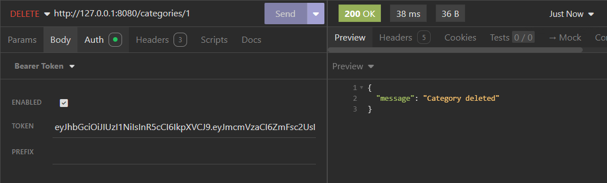

5. **Add a Blog to a Category**  
    - **HTTP Verb:** `POST`
    - **Path:** `http://localhost:8080/categories/<int:category_id>/blogs/<int:blog_id>`
    - **Required Data:**  
        - **Body(JSON):** None
        - **Headers:** `Authorisation:` Bearer `<JWT token>`
    - **Response:**
        - **Success:**
            - 200: The updated category with the blog added.
        
        - **Failure:**
            - 403: If the user does not have permission to add the blog.
            - 404: If the category or blog is not found.
            - 500: If an error occurs while adding the blog to the category.
    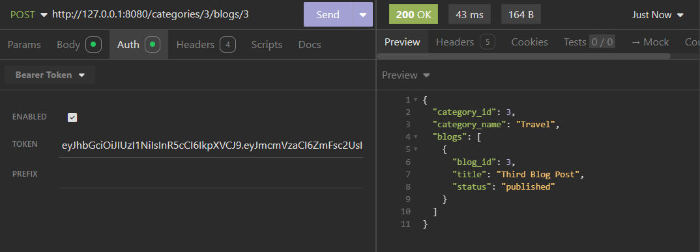

6. **Remove a Blog from a Category**  
    - **HTTP Verb:** `DELETE`
    - **Path:** `http://localhost:8080/categories/<int:category_id>/blogs/<int:blog_id>`
    - **Required Data:**  
        - **Body(JSON):** None
        - **Headers:** `Authorisation:` Bearer `<JWT token>`
    - **Response:**
        - **Success:**
            - 200: The updated category with the blog removed.
        
        - **Failure:**
            - 403: If the user does not have permission to remove the blog.
            - 404: If the category or blog is not found.
            - 500: If an error occurs while removing the blog from the category.
    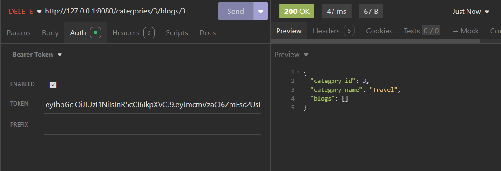

## Media Endpoints

1. **Upload Media to a Blog Post**  
    - **HTTP Verb:** `POST`
    - **Path:** `http://localhost:8080/media/upload`
    - **Required Data:**  
        - **Body(JSON):** 
            - **Multipart form data:** "file": The media file to upload, "blog_id"
        - **Headers:** `Authorisation:` Bearer `<JWT token>`
    - **Response:**
        - **Success:**
            - 201: If the media is successfully uploaded and saved.
        
        - **Failure:**
            - 400: If the file or blog ID is missing or the file type is not allowed.
            - 403: If the user does not have permission to upload media for the blog.
            - 404: If the blog is not found.
            - 500: If a database or unexpected error occurs.
    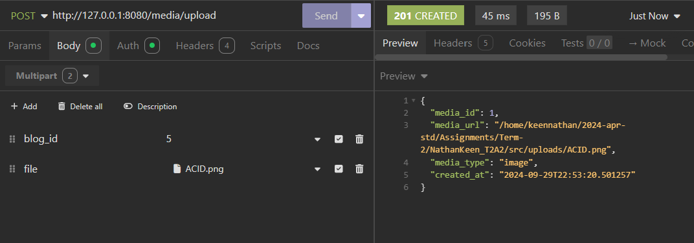


2. **Get Media by ID**  
    - **HTTP Verb:** `GET`
    - **Path:** `http://localhost:8080/media/<int:media_id>`
    - **Required Data:**  
        - **Body(JSON):** None
        - **Headers:** `Authorisation:` Bearer `<JWT token>`
    - **Response:**
        - **Success:**
            - 200: If the media is found and returned.
        
        - **Failure:**
            - 404: If the media is not found.
            - 500: If a database or unexpected error occurs.
    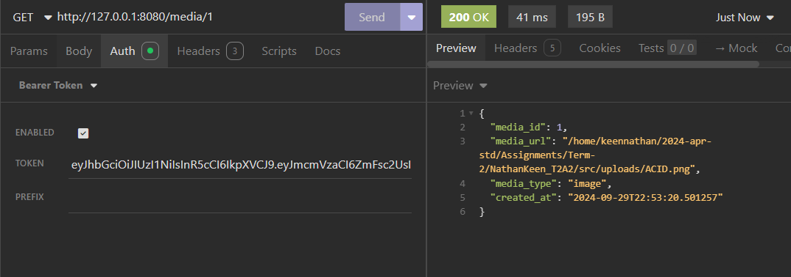


3. **Get Media by Blog ID**  
    - **HTTP Verb:** `GET`
    - **Path:** `http://localhost:8080/media/blog/<int:blog_id>`
    - **Required Data:**  
        - **Body(JSON):** None
        - **Headers:** `Authorisation:` Bearer `<JWT token>`
    - **Response:**
        - **Success:**
            - 200: If media files are found and returned.
        
        - **Failure:**
            - 404: If no media is found for the specified blog.
            - 500: If a database or unexpected error occurs.
    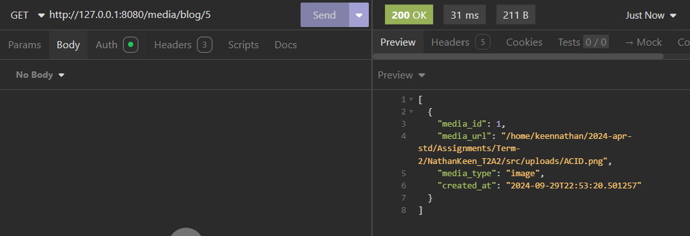

4. **Delete Media by ID**  
    - **HTTP Verb:** `DELETE`
    - **Path:** `http://localhost:8080/media/<int:media_id>`
    - **Required Data:**  
        - **Body(JSON):** None
        - **Headers:** `Authorisation:` Bearer `<JWT token>`
    - **Response:**
        - **Success:**
            - 200: If the media file is deleted successfully.
        
        - **Failure:**
            - 403: If the user does not have permission to delete the media.
            - 404: If the media or user is not found.
            - 500: If a database or unexpected error occurs.
    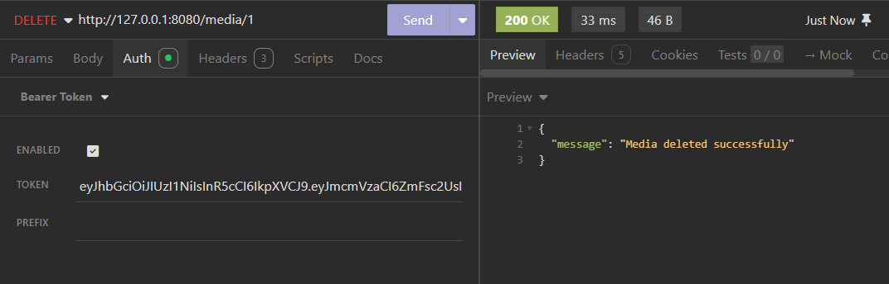